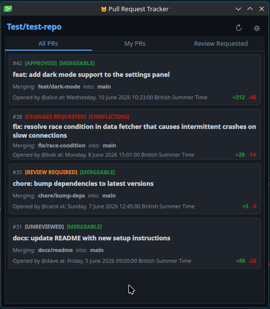

# GitHub PR Tracker

Displays open pull requests from a GitHub repository using the `gh` CLI.

## Preview

Shows a scrollable list of open PRs with:
- PR number, title, and review status
- Merge conflict status
- Branch info (head → base)
- Author and opened date
- Lines added/removed
- Auto-refreshes every 5 minutes
- Click any PR to open it in your browser

## Requirements

- [`gh` CLI](https://cli.github.com/) installed and authenticated

## Installation

## Development

## License

GPL-2.0+